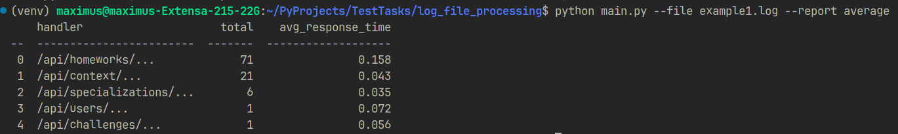
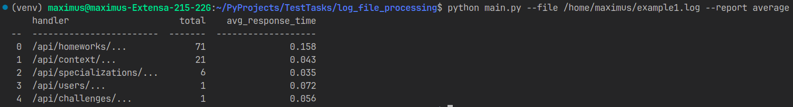
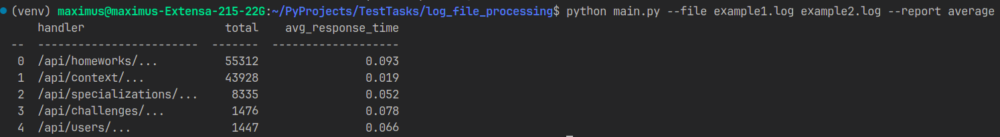
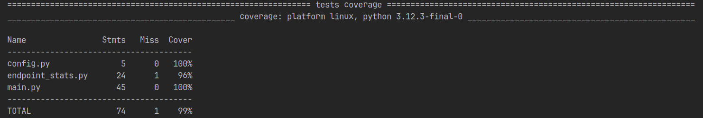

# Скрипт для обработки лог-файлов

## ✅ Функционал:
- **Формирование отчёта** со списком эндпоинтов:
  - количество запросов по каждому эндпоинту;
  - среднее время ответа.
  
  

- **Поддержка передачи пути к файлам** (одного или нескольких):

  
  

- **Выбор типа отчёта** (по умолчанию: `average`).

- **Полное тестирование с помощью pytest**  
  Покрытие: **99%**

  

---

## 🚀 Запуск:
```bash
python main.py --file file1.log file2.log --report average
